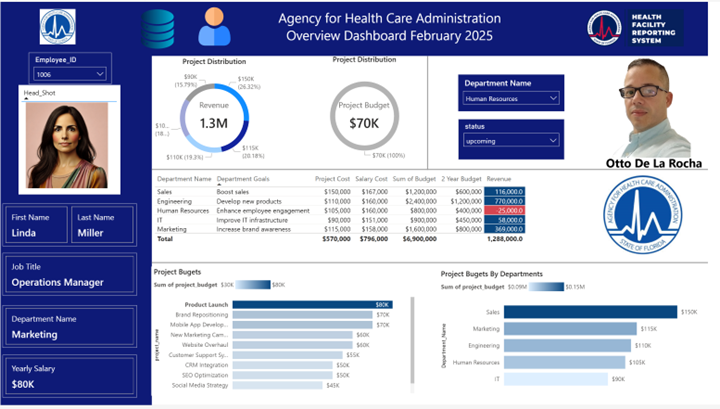
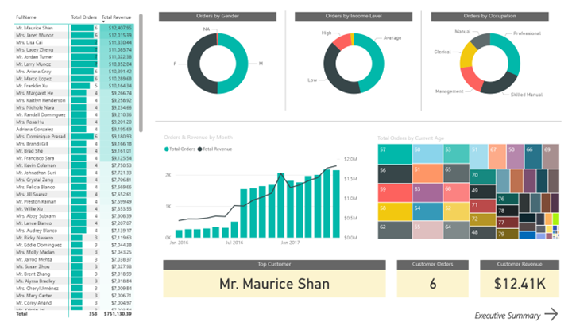
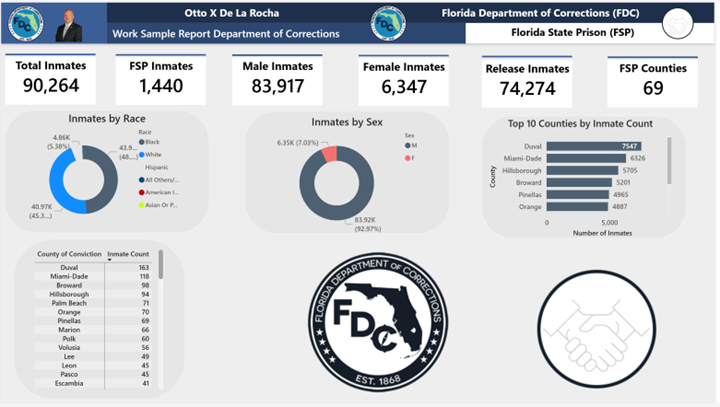
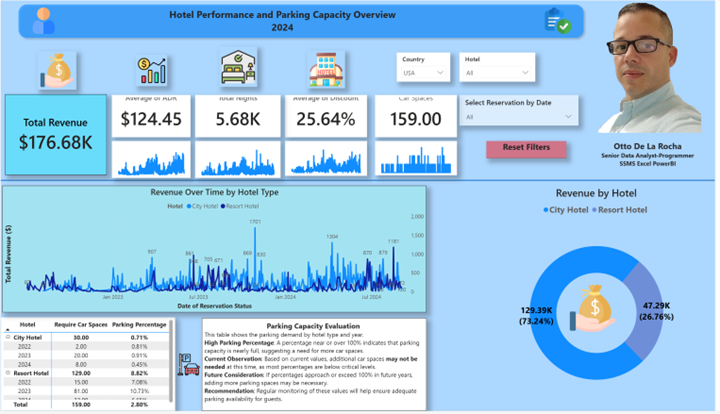
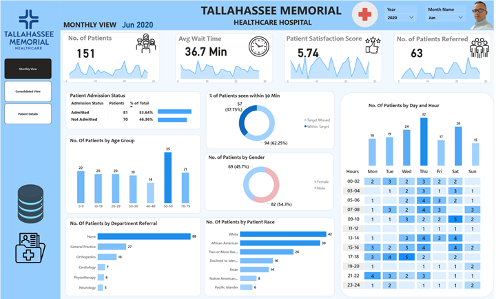
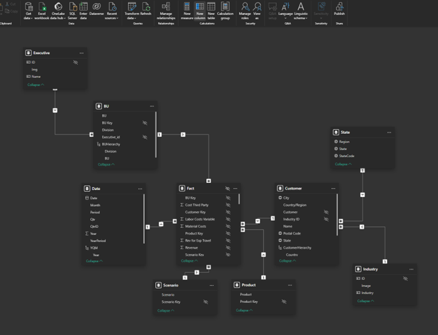

# Otto (Xavier) De La Rocha — Power BI + SQL (SSMS) Portfolio

I build end-to-end analytics solutions: stakeholder requirements → data modeling → ETL (Extract, Transform, Load) → SQL queries → Power BI dashboards.

## What I’m strongest at
- **Power BI**: interactive dashboards, drill-through, slicers, KPI design, DAX (Data Analysis Expressions), clean report layout and storytelling
- **SQL Server / SSMS (SQL Server Management Studio)**: SQL querying, ETL pipelines, data modeling (star schema), data validation and quality checks
- **Excel**: reporting, analysis, data cleanup, stakeholder-ready outputs
- **Delivery**: requirements gathering, translating business questions into metrics, iterative improvements, and clear documentation

## Projects (public)
- **SSMS Data Modeling & Engineering** — Modern warehouse build + ETL + analytics  
  https://github.com/xavi00ccxm/SSMS-Data-Modeling-and-Engineering

- **Florida Federated Data Architecture** — Data architecture design, governance, and integration patterns  
  https://github.com/xavi00ccxm/Florida-Federated-Data-Architecture

## Power BI dashboard samples
> Upload your screenshots into `powerbi-screenshots/` and update the file names below.

### Executive / Overview Dashboard

### Department & Budget Drill-Down

### Employee / Detail View

### Additional samples

## Contact
- GitHub: https://github.com/xavi00ccxm
